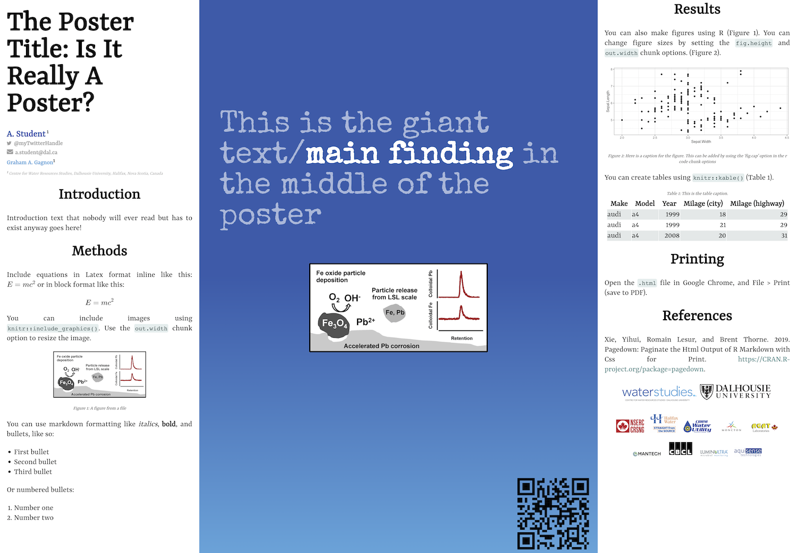

# cwrs_poster_template

<!-- badges: start -->
<!-- badges: end -->

Make a poster for the [CWRS](https://waterstudies.ca/) using RMarkdown + [posterdown](https://github.com/brentthorne/posterdown)!

1. Click the green **Clone or download** button above, then **Download ZIP**
2. Double click on `cwrs_poster_template.Rproj` to open RStudio
3. Install [posterdown](https://github.com/brentthorne/posterdown) (`install.packages("posterdown")`) if you haven't already
4. Edit `poster.Rmd`, using the **Knit** button to preview the poster.
5. Render the poster using **Knit**, then open `poster.html` in [Google Chrome](https://google.com/chrome). Use *File* > *Print* then choose *Save as PDF*.

