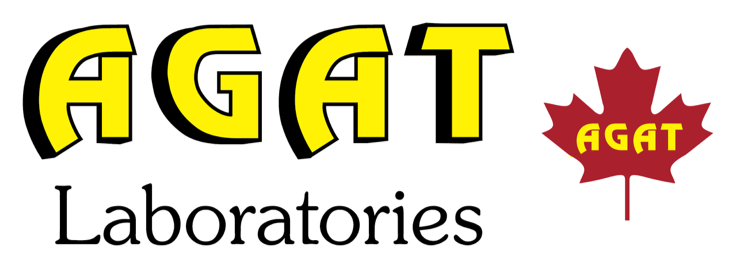

```{r setup, include=FALSE}
# load packages here
library(tidyverse)

# set the default ggplot2 theme
theme_set(theme_bw(10))

# this is a ggreat place to load data
# read_csv(...)

knitr::opts_chunk$set(
  echo = FALSE, dpi = 300,
  fig.align = "center", out.width = "100%"
)
```

# Introduction

Introduction text that nobody will ever read  but has to exist anyway goes here!

# Methods

Include equations in Latex format inline like this: $E = mc^2$ or in block format like this:

$$
E = mc^2
$$

You can include images using `knitr::include_graphics()`. Use the `out.width` chunk option to resize the image.

```{r, fig.cap="A figure from a file", out.width="50%"}
knitr::include_graphics("image-main.png")
```

<br/> <!-- insert this as many times as needed until the "Results" is at the top of the next side -->
<br/>
<br/>
<br/>
<br/>

# Results

You can also make figures using R (Figure 1). You can change figure sizes by setting  the `fig.height` and `out.width` chunk options. (Figure 2).

```{r, fig.cap="Here is a caption for the figure. This can be added by using the 'fig.cap' option in the r code chunk options", fig.height=3}
ggplot(iris, aes(Sepal.Width, Sepal.Length)) +
  geom_point()
```

You can create tables using `knitr::kable()` (Table 1).

```{r}
mpg %>%
head(3) %>%
  select(
    Make = manufacturer, 
    Model = model, 
    Year = year, 
    `Milage (city)` = cty,
    `Milage (highway)` = hwy
  ) %>%
  knitr::kable(
    caption = "This is  the table caption."
  )
```

# Printing

Open the `.html` file in Google Chrome, and File > Print (save to PDF).

# References

Xie, Yihui, Romain Lesur, and Brent Thorne. 2019. Pagedown: Paginate the Html Output of R Markdown with Css for Print. https://CRAN.R-project.org/package=pagedown.

<!-- water studies/dal  logos -->
<div class="figure" style="text-align: center">
  
  
</div>

<!-- partner logos --->

<div class="figure" style="text-align: center; vertical-align: middle">
  
  
  
  
  
  
  
  
  
</div>
