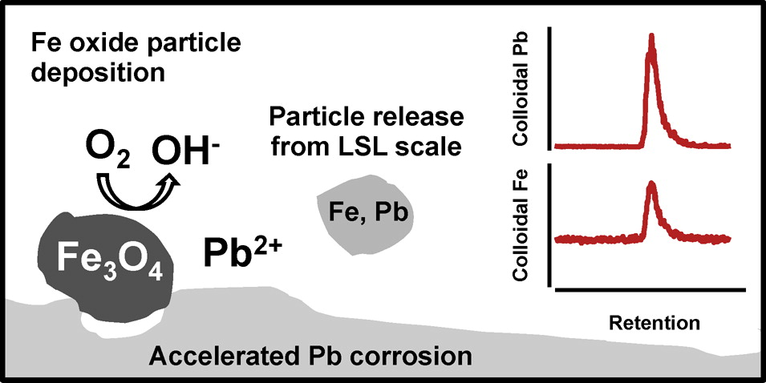
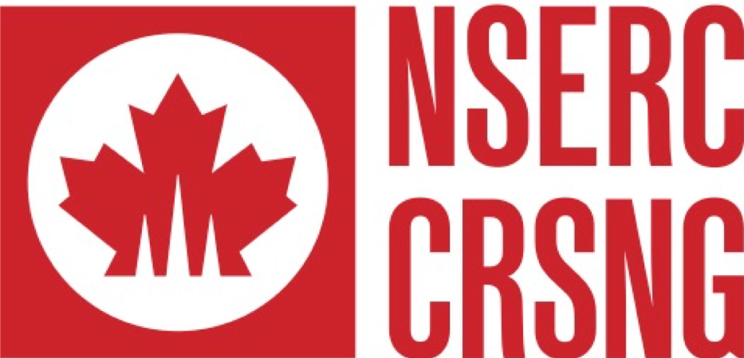
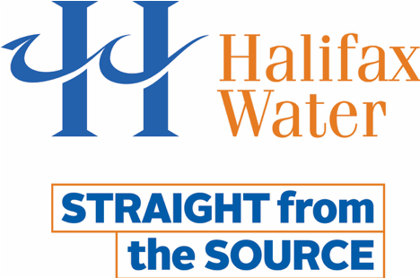
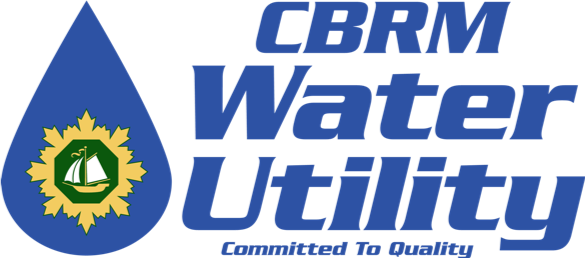
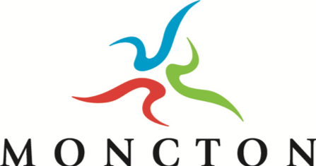
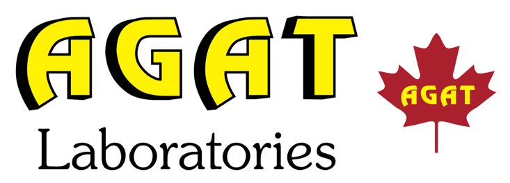
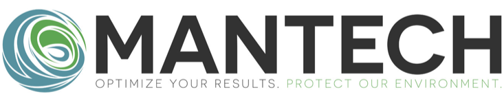

```{r setup, include=FALSE}
library(tidyverse)
theme_set(theme_bw())
options(htmltools.dir.version = FALSE)
knitr::opts_chunk$set(dpi = 300, fig.align = "center", echo = FALSE, fig.height = 4)
```

# The title of a slide

The content of the slide, using some *basic* **markdown** syntax. You can include images using `knitr::include_graphics()`. Use the `out.width` chunk option to resize the image.

```{r, fig.cap="A figure from a file", out.width="50%"}

```

<!-- the '---' creates a new slide -->

---
class: center, middle

# Centred slide content

### (with a subheading)

---
class: inverse

# Resist the dark slide!

But actually, you can totally make slides dark [1].

.footnote[
[1] And include footnotes.
]

---

Slides don't have to have a title either.

---
background-image: url("image-main.jpeg")
background-size: cover

<!-- this is a single huge image on a slide -->

---

# A two-column slide

Some differences between using remark.js (left) and using **xaringan** (right):

.pull-left[
- bullet 1
- bullet 2
- bullet 3
]

.pull-right[
- bullet 1
- bullet 2
- bullet 3
]

---

# Math Expressions

You can write LaTeX math expressions inside a pair of dollar signs, e.g. $E = mc^2$. You can use the display style with double dollar signs:

$$E = mc^2$$

---

# R Plots

```{r}
ggplot(mpg, aes(cty, hwy))  +
  geom_point()
```

---

# Tables

If you want to generate a table, make sure it is in the HTML format (instead of Markdown or other formats), e.g.,

```{r}
knitr::kable(head(iris), format = 'html')
```

---

# Acknowledgements

The research team acknowledges the support from...

<!-- water studies/dal  logos -->
<div class="figure" style="text-align: center">
  
  
</div>

<!-- partner logos --->

<div class="figure figure-partner">
  
  
  
  
  
  
  
  
  
</div>

.footnote[
Slides created using [xaringan](https://github.com/yihui/xaringan), [remark.js](https://remarkjs.com), [knitr](http://yihui.name/knitr), and [R Markdown](https://rmarkdown.rstudio.com).
]
