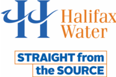
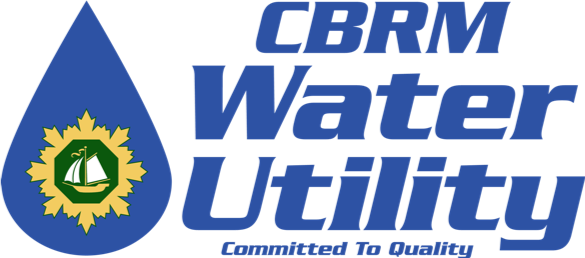
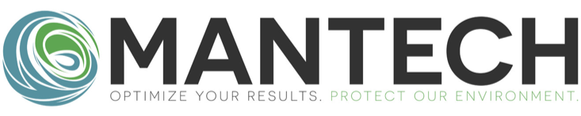

```{r setup, include=FALSE}
library(tidyverse)
knitr::opts_chunk$set(echo = FALSE, fig.height = 4)
```

## Metals in the Maritimes

- New slides start with `##`

<span class="reference">Dunnington et al. (in press, Environmental Pollution)<span>

## Acknowledgements

The research team acknowledges the support from...

<!-- water studies/dal  logos -->
<div class="figure" style="text-align: center">
  
  
</div>

<!-- partner logos --->

<div class="figure figure-partner">
  
  
  
  
  
  
  
  
  
</div>

<span class="reference">
Slides created using [xaringan](https://github.com/yihui/xaringan), [remark.js](https://remarkjs.com), [knitr](http://yihui.name/knitr), and [R Markdown](https://rmarkdown.rstudio.com).
<span>

